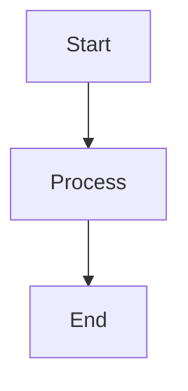

# yAudit Research Site

## Adding New Content

### 1. Add Category to categories.json

Edit `lib/categories.json` to add your category:

```json
{
  "categories": {
    "your-category": {
      "title": "Your Category Title",
      "description": "Category description for SEO",
      "contentPath": "content/your-category",
      "authors": [
        {
          "name": "Author Name",
          "twitter": "https://twitter.com/handle",
          "avatar": "https://avatars.githubusercontent.com/username"
        }
      ],
      "seo": {
        "title": "SEO Title | yAudit Research",
        "description": "SEO description",
        "keywords": ["keyword1", "keyword2", "keyword3"],
        "baseUrl": "https://research.yaudit.dev/your-category"
      },
      "structure": {
        "your-category": "Category Home",
        "topic-1": "Topic 1 Title",
        "topic-2": {
          "title": "Topic 2 with Subpages",
          "subpages": {
            "subtopic-1": "Subtopic Title"
          }
        }
      }
    }
  }
}
```

### 2. Create Content Directory

```bash
mkdir content/your-category
```

### 3. Add Content Files

Create markdown files based on your structure:

```bash
# Required: Category landing page
echo "# Your Category" > content/your-category/home.md

# Add topics from your structure
echo "# Topic 1" > content/your-category/topic-1.md
echo "# Topic 2" > content/your-category/topic-2.md
echo "# Subtopic" > content/your-category/subtopic-1.md
```

### 4. Include Frontmatter

Add frontmatter to each markdown file:

```markdown
---
title: "Your Page Title"
author: "Author Name"
---

# Your Content

Content goes here...

***Research by [Author](https://twitter.com/handle) of [yAudit](https://yaudit.dev).*
```

### 5. Add Images

Store images in the appropriate category folder:

```bash
# Create category image directory
mkdir -p public/your-category

# Add your images
cp your-image.png public/your-category/

# Reference in markdown

```

### 6. Use Table of Contents

Add `{:toc}` anywhere in your markdown to generate a table of contents:

```markdown
# Page Title

{:toc}

## Section 1
Content here...

## Section 2
More content...
```

### 7. Add Mermaid Diagrams

Include diagrams using mermaid code blocks:

````markdown

````

Your content will be automatically available at:
- `research.yaudit.dev/your-category` (home.md)
- `research.yaudit.dev/your-category/topic-1` (topic-1.md)